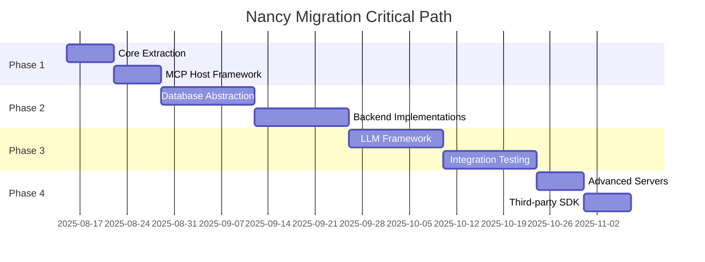

# Nancy Migration Roadmap
## From Monolithic Super-RAG to Configurable MCP Orchestration Platform

**Document Version:** 1.0  
**Date:** August 15, 2025  
**Author:** Strategic Technical Architect  
**Status:** Implementation Plan  

---

## Executive Summary

This roadmap outlines the strategic transformation of Nancy from a monolithic Four-Brain system to a configurable MCP orchestration platform. The migration preserves Nancy's intelligent capabilities while adding enterprise-grade configurability and extensibility. The plan spans 12 weeks across 4 phases, maintaining backwards compatibility throughout the transition.

### Strategic Outcomes

- **Technical**: Configurable databases, LLMs, and extensible MCP server ecosystem
- **Business**: Enterprise deployment flexibility and partner ecosystem enablement  
- **Positioning**: Nancy as "composable intelligence platform" for engineering teams
- **Risk Mitigation**: Phased approach with backwards compatibility and rollback capabilities

---

## Migration Overview

### Current State Analysis

**Existing Nancy Architecture**:
```
┌─────────────────────────────────────────────────┐
│                Nancy Monolith                   │
├─────────────────────────────────────────────────┤
│  LangChain Orchestrator (langchain_orchestrator.py)
│  ├── Vector Brain (ChromaDB + FastEmbed)       │
│  ├── Analytical Brain (DuckDB)                 │
│  ├── Graph Brain (Neo4j + Foundational Schema) │
│  └── Linguistic Brain (Gemma 3n-e4b-it)        │
├─────────────────────────────────────────────────┤
│  Direct Ingestion (ingestion.py)               │
│  ├── Text file processing                      │
│  ├── Spreadsheet parsing (openpyxl)           │
│  ├── Code analysis (AST, git)                  │
│  └── Entity extraction (spaCy)                 │
└─────────────────────────────────────────────────┘
```

**Target State Architecture**:
```
┌─────────────────────────────────────────────────────────────────┐
│                      Nancy Core (MCP Host)                      │
├─────────────────────────────────────────────────────────────────┤
│  Configuration Manager    │    Four-Brain Orchestrator         │
│  ├── Database Config      │    ├── Vector Brain (Configurable) │
│  ├── LLM Config          │    ├── Analytical Brain (Config)   │
│  └── MCP Server Config    │    ├── Graph Brain (Configurable)  │
│                          │    └── Linguistic Brain (Config)    │
├─────────────────────────────────────────────────────────────────┤
│                      MCP Client Manager                         │
├─────────────────────────────────────────────────────────────────┤
│ ┌─────────────┐ ┌─────────────┐ ┌─────────────┐ ┌─────────────┐ │
│ │ Document    │ │ Spreadsheet │ │ Codebase    │ │ Real-time   │ │
│ │ MCP Server  │ │ MCP Server  │ │ MCP Server  │ │ MCP Server  │ │
│ └─────────────┘ └─────────────┘ └─────────────┘ └─────────────┘ │
└─────────────────────────────────────────────────────────────────┘
```

---

## Phase 1: Core Extraction and MCP Foundation (Weeks 1-2)

### 1.1 Objectives

- Extract Nancy Core orchestration logic from monolithic structure
- Implement basic MCP host capabilities
- Create initial MCP server (Document Server)
- Establish configuration system foundation
- Maintain 100% backwards compatibility

### 1.2 Week 1 Tasks

#### Task 1.1: Project Structure Reorganization
**Timeline**: Days 1-2  
**Responsible**: Core Development Team  

```bash
# New project structure
nancy/
├── nancy-core/                    # NEW: Extracted orchestration engine
│   ├── __init__.py
│   ├── orchestrator.py           # Extracted from langchain_orchestrator.py
│   ├── configuration.py          # NEW: Configuration management
│   ├── mcp_host.py               # NEW: MCP host implementation
│   └── knowledge_packet.py       # NEW: Packet schema implementation
├── nancy-services/               # EXISTING: Legacy services (preserved)
│   ├── api/
│   ├── core/                     # Keep for backwards compatibility
│   └── ...
├── mcp-servers/                  # NEW: MCP server implementations
│   ├── document/
│   │   ├── server.py            # NEW: Document MCP server
│   │   └── requirements.txt
│   └── base/
│       └── nancy_mcp_server.py  # NEW: Base server class
├── docs/                        # NEW: Architecture documentation
│   ├── nancy-mcp-architecture-blueprint.md
│   ├── nancy-knowledge-packet-schema.json
│   ├── nancy-configuration-schema.yaml
│   └── nancy-mcp-integration-specification.md
└── config/                      # NEW: Configuration files
    ├── nancy-config.yaml        # Default configuration
    ├── nancy-config-dev.yaml    # Development override
    └── nancy-config-prod.yaml   # Production template
```

**Deliverables**:
- [ ] Reorganized project structure
- [ ] Updated Docker composition
- [ ] Modified import paths throughout codebase
- [ ] Verified all existing functionality works

#### Task 1.2: Extract Orchestration Logic
**Timeline**: Days 2-3  
**Dependencies**: Task 1.1  

**Extract from `langchain_orchestrator.py`**:
```python
# nancy-core/orchestrator.py
class FourBrainOrchestrator:
    """
    Extracted and enhanced Four-Brain orchestration logic.
    Maintains existing LangChain router patterns while adding configurability.
    """
    
    def __init__(self, brain_configs: Dict[str, BrainConfig]):
        # Initialize brains based on configuration
        self.vector_brain = self._create_vector_brain(brain_configs["vector"])
        self.analytical_brain = self._create_analytical_brain(brain_configs["analytical"])
        self.graph_brain = self._create_graph_brain(brain_configs["graph"])
        self.linguistic_brain = self._create_linguistic_brain(brain_configs["linguistic"])
        
        # Preserve existing LangChain router setup
        self.setup_langchain_router()
    
    def _create_vector_brain(self, config: VectorBrainConfig):
        """Create vector brain based on configuration"""
        if config.backend == "chromadb":
            return ChromaDBVectorBrain(config.connection)
        elif config.backend == "weaviate":
            return WeaviateVectorBrain(config.connection)
        # Add other backends
        
    # Preserve existing query method signature for compatibility
    def query(self, query_text: str, n_results: int = 5) -> Dict[str, Any]:
        """Maintain existing query interface"""
        # Use existing query logic with configurable backends
        pass
```

**Deliverables**:
- [ ] Extracted orchestrator to `nancy-core/orchestrator.py`
- [ ] Maintained existing API compatibility
- [ ] Added brain factory methods for configurability
- [ ] Preserved LangChain router patterns
- [ ] Unit tests for extracted functionality

#### Task 1.3: Basic Configuration System
**Timeline**: Days 3-4  
**Dependencies**: Task 1.2  

```python
# nancy-core/configuration.py
from pydantic import BaseModel
import yaml
from typing import Dict, Any, Optional

class NancyCoreConfig(BaseModel):
    """Pydantic model for Nancy Core configuration"""
    nancy_core: Dict[str, Any]
    orchestration: Dict[str, Any]  
    brains: Dict[str, Any]
    mcp_servers: Dict[str, Any]
    security: Optional[Dict[str, Any]] = None
    performance: Optional[Dict[str, Any]] = None
    logging: Optional[Dict[str, Any]] = None

class ConfigurationManager:
    """Manages Nancy Core configuration loading and validation"""
    
    def __init__(self, config_path: str = "config/nancy-config.yaml"):
        self.config_path = config_path
        self.config: Optional[NancyCoreConfig] = None
        
    def load_config(self) -> NancyCoreConfig:
        """Load and validate configuration"""
        with open(self.config_path, 'r') as f:
            config_data = yaml.safe_load(f)
            
        # Apply environment variable substitution
        config_data = self._substitute_environment_variables(config_data)
        
        # Validate against schema
        self.config = NancyCoreConfig(**config_data)
        return self.config
```

**Deliverables**:
- [ ] Configuration management system
- [ ] Default configuration file
- [ ] Environment variable substitution
- [ ] Configuration validation with Pydantic
- [ ] Development and production config templates

### 1.3 Week 2 Tasks

#### Task 1.4: Implement MCP Host Framework
**Timeline**: Days 5-7  
**Dependencies**: Task 1.3  

```python
# nancy-core/mcp_host.py
class NancyMCPHost:
    """
    Nancy Core MCP Host implementation.
    Manages MCP client connections and orchestrates knowledge packet processing.
    """
    
    def __init__(self, config: NancyCoreConfig):
        self.config = config
        self.orchestrator = FourBrainOrchestrator(config.brains)
        self.mcp_clients: Dict[str, MCPClient] = {}
        self.packet_queue = asyncio.Queue()
        self.error_handler = MCPErrorHandler()
        
    async def start(self):
        """Start MCP host and all configured servers"""
        # Start MCP servers based on configuration
        for server_config in self.config.mcp_servers.enabled_servers:
            await self.start_mcp_server(server_config)
            
        # Start packet processing worker
        self.packet_processor = asyncio.create_task(self.process_packet_queue())
        
    async def ingest_content(self, server_name: str, source_path: str, 
                           metadata: Dict[str, Any]) -> str:
        """Request content ingestion from MCP server"""
        # Implement MCP communication for ingestion
        pass
```

**Deliverables**:
- [ ] MCP host implementation
- [ ] MCP client management
- [ ] Knowledge packet queue processing
- [ ] Error handling framework
- [ ] Basic health monitoring

#### Task 1.5: Create Document MCP Server
**Timeline**: Days 7-9  
**Dependencies**: Task 1.4  

```python
# mcp-servers/document/server.py
from nancy.mcp.base_server import NancyMCPServer

class DocumentMCPServer(NancyMCPServer):
    """Initial MCP server for document ingestion"""
    
    def get_server_name(self) -> str:
        return "nancy-document-server"
        
    def get_supported_file_types(self) -> List[str]:
        return [".txt", ".md", ".pdf", ".docx"]
        
    async def ingest_content(self, source_path: str, 
                           metadata: Dict[str, Any]) -> NancyKnowledgePacket:
        """Convert document to Nancy Knowledge Packet"""
        # Extract existing ingestion logic from ingestion.py
        # Convert to Knowledge Packet format
        pass
```

**Deliverables**:
- [ ] Base MCP server class
- [ ] Document MCP server implementation  
- [ ] Knowledge packet generation
- [ ] Integration with existing document processing logic
- [ ] Server health checking

#### Task 1.6: Integration and Testing
**Timeline**: Days 9-10  
**Dependencies**: Tasks 1.4, 1.5  

**Integration Steps**:
1. **Legacy Compatibility Layer**: Create adapter that maintains existing API
2. **Dual-Mode Operation**: Support both legacy and MCP modes
3. **Testing**: Comprehensive testing of new vs old functionality
4. **Performance Validation**: Ensure no performance regression

```python
# nancy-services/api/legacy_adapter.py
class LegacyNancyAdapter:
    """Maintains existing API while using new MCP architecture internally"""
    
    def __init__(self, nancy_host: NancyMCPHost):
        self.nancy_host = nancy_host
        
    def query(self, query_text: str, n_results: int = 5) -> Dict[str, Any]:
        """Legacy query interface"""
        return asyncio.run(self.nancy_host.orchestrator.query(query_text, n_results))
        
    def ingest(self, file_path: str, author: str = None) -> Dict[str, Any]:
        """Legacy ingestion interface"""
        metadata = {"author": author} if author else {}
        packet_id = asyncio.run(
            self.nancy_host.ingest_content("nancy-document-server", file_path, metadata)
        )
        return {"packet_id": packet_id, "status": "processed"}
```

**Deliverables**:
- [ ] Legacy compatibility adapter
- [ ] Integration tests
- [ ] Performance benchmarks
- [ ] Documentation updates
- [ ] Docker configuration updates

### 1.4 Phase 1 Success Criteria

- [ ] Nancy Core extracted and operational
- [ ] Basic MCP host functionality working
- [ ] Document MCP server processing files
- [ ] Configuration system loading and validating configs
- [ ] 100% backwards compatibility maintained
- [ ] All existing tests passing
- [ ] Performance within 5% of baseline

### 1.5 Phase 1 Deliverables

**Code**:
- `nancy-core/` module with orchestration logic
- `mcp-servers/document/` server implementation
- `config/` directory with configuration files
- Updated Docker composition

**Documentation**:
- Architecture blueprint
- Configuration schema documentation
- Migration guide for Phase 1
- API compatibility documentation

**Testing**:
- Unit tests for extracted components
- Integration tests for MCP communication
- Performance benchmarks
- Backwards compatibility test suite

---

## Phase 2: Database Configurability (Weeks 3-6)

### 2.1 Objectives

- Make database backends configurable for all Four Brains
- Implement database abstraction layers
- Add support for multiple database providers
- Create migration utilities between backends
- Maintain query performance across backends

### 2.2 Week 3 Tasks

#### Task 2.1: Database Abstraction Framework
**Timeline**: Days 11-13  
**Dependencies**: Phase 1 completion  

```python
# nancy-core/brains/abstract.py
from abc import ABC, abstractmethod
from typing import List, Dict, Any, Optional

class VectorBrainInterface(ABC):
    """Abstract interface for vector storage backends"""
    
    @abstractmethod
    async def add_documents(self, documents: List[str], 
                          metadatas: List[Dict[str, Any]], 
                          ids: List[str]) -> bool:
        pass
        
    @abstractmethod
    async def query(self, query_texts: List[str], 
                   n_results: int) -> Dict[str, Any]:
        pass
        
    @abstractmethod
    async def health_check(self) -> Dict[str, Any]:
        pass

class AnalyticalBrainInterface(ABC):
    """Abstract interface for analytical storage backends"""
    
    @abstractmethod
    async def execute_query(self, sql: str) -> List[tuple]:
        pass
        
    @abstractmethod
    async def insert_structured_data(self, table_name: str, 
                                   data: Dict[str, Any]) -> bool:
        pass

class GraphBrainInterface(ABC):
    """Abstract interface for graph storage backends"""
    
    @abstractmethod
    async def add_entity(self, entity_type: str, entity_name: str, 
                        properties: Dict[str, Any]) -> bool:
        pass
        
    @abstractmethod
    async def add_relationship(self, source_type: str, source_name: str,
                             relationship_type: str, target_type: str, 
                             target_name: str, properties: Dict[str, Any]) -> bool:
        pass
```

**Deliverables**:
- [ ] Abstract interfaces for all brain types
- [ ] Factory pattern for brain creation
- [ ] Configuration-driven brain instantiation
- [ ] Interface validation framework

#### Task 2.2: Vector Brain Backend Implementations
**Timeline**: Days 13-15  

**ChromaDB Implementation** (existing, refactored):
```python
# nancy-core/brains/vector/chromadb_brain.py
class ChromaDBVectorBrain(VectorBrainInterface):
    """ChromaDB implementation of Vector Brain"""
    
    def __init__(self, config: ChromaDBConfig):
        self.client = chromadb.HttpClient(
            host=config.host,
            port=config.port,
            ssl=config.ssl
        )
        self.collection_name = config.collection_name
        self.embedding_model = config.embedding_model
```

**Weaviate Implementation** (new):
```python
# nancy-core/brains/vector/weaviate_brain.py
class WeaviateVectorBrain(VectorBrainInterface):
    """Weaviate implementation of Vector Brain"""
    
    def __init__(self, config: WeaviateConfig):
        import weaviate
        
        self.client = weaviate.Client(
            url=config.url,
            auth_client_secret=weaviate.AuthApiKey(api_key=config.api_key) if config.api_key else None
        )
        self.class_name = config.class_name
```

**FAISS Implementation** (new):
```python
# nancy-core/brains/vector/faiss_brain.py
class FAISSVectorBrain(VectorBrainInterface):
    """FAISS implementation of Vector Brain"""
    
    def __init__(self, config: FAISSConfig):
        import faiss
        import numpy as np
        
        self.index_path = config.index_path
        self.dimension = config.dimension
        self.index = faiss.IndexFlatIP(self.dimension)
```

**Deliverables**:
- [ ] ChromaDB implementation (refactored)
- [ ] Weaviate implementation
- [ ] FAISS implementation
- [ ] Pinecone implementation
- [ ] Performance benchmarks across backends

### 2.3 Week 4 Tasks

#### Task 2.3: Analytical Brain Backend Implementations
**Timeline**: Days 16-18  

**DuckDB Implementation** (existing, refactored):
```python
# nancy-core/brains/analytical/duckdb_brain.py
class DuckDBAnalyticalBrain(AnalyticalBrainInterface):
    """DuckDB implementation of Analytical Brain"""
    
    def __init__(self, config: DuckDBConfig):
        import duckdb
        
        self.connection = duckdb.connect(
            database=config.database_path,
            read_only=config.read_only
        )
        # Set memory limit
        self.connection.execute(f"SET memory_limit='{config.memory_limit}'")
```

**PostgreSQL Implementation** (new):
```python
# nancy-core/brains/analytical/postgresql_brain.py
class PostgreSQLAnalyticalBrain(AnalyticalBrainInterface):
    """PostgreSQL implementation of Analytical Brain"""
    
    def __init__(self, config: PostgreSQLConfig):
        import asyncpg
        
        self.connection_string = config.connection_string or (
            f"postgresql://{config.username}:{config.password}@"
            f"{config.host}:{config.port}/{config.database}"
        )
        self.pool = None
        
    async def _ensure_connection(self):
        if self.pool is None:
            self.pool = await asyncpg.create_pool(self.connection_string)
```

**ClickHouse Implementation** (new):
```python
# nancy-core/brains/analytical/clickhouse_brain.py  
class ClickHouseAnalyticalBrain(AnalyticalBrainInterface):
    """ClickHouse implementation of Analytical Brain"""
    
    def __init__(self, config: ClickHouseConfig):
        from clickhouse_driver import Client
        
        self.client = Client(
            host=config.host,
            port=config.port,
            database=config.database,
            user=config.username,
            password=config.password
        )
```

**Deliverables**:
- [ ] DuckDB implementation (refactored)
- [ ] PostgreSQL implementation  
- [ ] ClickHouse implementation
- [ ] SQLite implementation
- [ ] Schema migration utilities

#### Task 2.4: Graph Brain Backend Implementations
**Timeline**: Days 18-20  

**Neo4j Implementation** (existing, refactored):
```python
# nancy-core/brains/graph/neo4j_brain.py
class Neo4jGraphBrain(GraphBrainInterface):
    """Neo4j implementation of Graph Brain"""
    
    def __init__(self, config: Neo4jConfig):
        from neo4j import GraphDatabase
        
        self.driver = GraphDatabase.driver(
            config.uri,
            auth=(config.username, config.password)
        )
        self.database = config.database
        self.schema_mode = config.schema_mode
        
        # Initialize foundational schema if required
        if self.schema_mode == "foundational":
            asyncio.create_task(self.setup_foundational_schema())
```

**ArangoDB Implementation** (new):
```python
# nancy-core/brains/graph/arangodb_brain.py
class ArangoDBGraphBrain(GraphBrainInterface):
    """ArangoDB implementation of Graph Brain"""
    
    def __init__(self, config: ArangoDBConfig):
        from arango import ArangoClient
        
        self.client = ArangoClient(hosts=config.url)
        self.db = self.client.db(
            config.database,
            username=config.username,
            password=config.password
        )
```

**Deliverables**:
- [ ] Neo4j implementation (refactored)
- [ ] ArangoDB implementation
- [ ] TigerGraph implementation
- [ ] Foundational schema migration utilities
- [ ] Graph query translation layer

### 2.4 Week 5 Tasks

#### Task 2.5: Brain Factory and Configuration System
**Timeline**: Days 21-23  

```python
# nancy-core/brains/factory.py
class BrainFactory:
    """Factory for creating brain instances based on configuration"""
    
    @staticmethod
    def create_vector_brain(config: VectorBrainConfig) -> VectorBrainInterface:
        """Create vector brain based on backend configuration"""
        
        if config.backend == "chromadb":
            from .vector.chromadb_brain import ChromaDBVectorBrain
            return ChromaDBVectorBrain(config.connection)
        elif config.backend == "weaviate":
            from .vector.weaviate_brain import WeaviateVectorBrain
            return WeaviateVectorBrain(config.connection)
        elif config.backend == "faiss":
            from .vector.faiss_brain import FAISSVectorBrain
            return FAISSVectorBrain(config.connection)
        else:
            raise ValueError(f"Unsupported vector backend: {config.backend}")
            
    @staticmethod
    def create_analytical_brain(config: AnalyticalBrainConfig) -> AnalyticalBrainInterface:
        """Create analytical brain based on backend configuration"""
        
        if config.backend == "duckdb":
            from .analytical.duckdb_brain import DuckDBAnalyticalBrain
            return DuckDBAnalyticalBrain(config.connection)
        elif config.backend == "postgresql":
            from .analytical.postgresql_brain import PostgreSQLAnalyticalBrain
            return PostgreSQLAnalyticalBrain(config.connection)
        # Add other backends
        
    @staticmethod
    def create_graph_brain(config: GraphBrainConfig) -> GraphBrainInterface:
        """Create graph brain based on backend configuration"""
        
        if config.backend == "neo4j":
            from .graph.neo4j_brain import Neo4jGraphBrain
            return Neo4jGraphBrain(config.connection)
        elif config.backend == "arangodb":
            from .graph.arangodb_brain import ArangoDBGraphBrain
            return ArangoDBGraphBrain(config.connection)
        # Add other backends
```

**Enhanced Configuration Validation**:
```python
# nancy-core/configuration.py (enhanced)
class ConfigurationValidator:
    """Validates configuration against available backends"""
    
    SUPPORTED_BACKENDS = {
        "vector": ["chromadb", "weaviate", "faiss", "pinecone"],
        "analytical": ["duckdb", "postgresql", "sqlite", "clickhouse"],  
        "graph": ["neo4j", "arangodb", "tigergraph"]
    }
    
    def validate_brain_configs(self, brains_config: Dict[str, Any]) -> List[str]:
        """Validate brain configurations against supported backends"""
        errors = []
        
        for brain_type, config in brains_config.items():
            if brain_type in self.SUPPORTED_BACKENDS:
                backend = config.get("backend")
                if backend not in self.SUPPORTED_BACKENDS[brain_type]:
                    errors.append(
                        f"Unsupported {brain_type} backend: {backend}. "
                        f"Supported: {self.SUPPORTED_BACKENDS[brain_type]}"
                    )
                    
        return errors
```

**Deliverables**:
- [ ] Brain factory implementation
- [ ] Enhanced configuration validation
- [ ] Backend availability checking
- [ ] Runtime brain switching capability
- [ ] Configuration migration utilities

#### Task 2.6: Database Migration Utilities
**Timeline**: Days 23-25  

```python
# nancy-core/migration/database_migrator.py
class DatabaseMigrator:
    """Handles migration between different database backends"""
    
    def __init__(self, source_brain: Any, target_brain: Any):
        self.source_brain = source_brain
        self.target_brain = target_brain
        
    async def migrate_vector_data(self, batch_size: int = 1000):
        """Migrate vector data between backends"""
        
        # Export from source
        documents, metadatas, ids = await self.source_brain.export_all_data()
        
        # Import to target in batches
        for i in range(0, len(documents), batch_size):
            batch_docs = documents[i:i + batch_size]
            batch_metas = metadatas[i:i + batch_size] 
            batch_ids = ids[i:i + batch_size]
            
            await self.target_brain.add_documents(batch_docs, batch_metas, batch_ids)
            
    async def migrate_analytical_data(self):
        """Migrate analytical data between backends"""
        
        # Get all tables from source
        tables = await self.source_brain.list_tables()
        
        for table_name in tables:
            # Export table structure and data
            schema = await self.source_brain.get_table_schema(table_name)
            data = await self.source_brain.export_table_data(table_name)
            
            # Create table in target and import data
            await self.target_brain.create_table(table_name, schema)
            await self.target_brain.import_table_data(table_name, data)
            
    async def migrate_graph_data(self):
        """Migrate graph data between backends"""
        
        # Export entities and relationships
        entities = await self.source_brain.export_all_entities()
        relationships = await self.source_brain.export_all_relationships()
        
        # Import to target
        for entity in entities:
            await self.target_brain.add_entity(**entity)
            
        for relationship in relationships:
            await self.target_brain.add_relationship(**relationship)
```

**Deliverables**:
- [ ] Database migration framework
- [ ] Vector data migration utilities
- [ ] Analytical data migration utilities
- [ ] Graph data migration utilities
- [ ] Migration validation and rollback

### 2.5 Week 6 Tasks

#### Task 2.7: Integration Testing and Performance Optimization
**Timeline**: Days 26-30  

**Cross-Backend Testing**:
```python
# tests/integration/test_backend_compatibility.py
class TestBackendCompatibility:
    """Test that all brain implementations provide consistent results"""
    
    @pytest.mark.parametrize("vector_backend", ["chromadb", "weaviate", "faiss"])
    async def test_vector_brain_consistency(self, vector_backend, sample_documents):
        """Test that different vector backends return consistent results"""
        
        # Configure brain
        config = create_vector_config(vector_backend)
        brain = BrainFactory.create_vector_brain(config)
        
        # Add documents
        await brain.add_documents(sample_documents.texts, 
                                sample_documents.metadatas, 
                                sample_documents.ids)
        
        # Query and verify results
        results = await brain.query(["test query"], n_results=5)
        
        # Verify result structure
        assert "documents" in results
        assert len(results["documents"][0]) <= 5
        
    @pytest.mark.parametrize("analytical_backend", ["duckdb", "postgresql"])
    async def test_analytical_brain_consistency(self, analytical_backend, sample_data):
        """Test that different analytical backends support standard SQL"""
        
        config = create_analytical_config(analytical_backend)
        brain = BrainFactory.create_analytical_brain(config)
        
        # Test standard SQL operations
        await brain.execute_query("CREATE TABLE test (id INT, name TEXT)")
        await brain.execute_query("INSERT INTO test VALUES (1, 'test')")
        results = await brain.execute_query("SELECT * FROM test")
        
        assert len(results) == 1
        assert results[0] == (1, 'test')
```

**Performance Benchmarking**:
```python
# scripts/benchmark_backends.py
class BackendBenchmark:
    """Benchmark different backend implementations"""
    
    async def benchmark_vector_backends(self, test_documents: List[str]):
        """Benchmark vector backend performance"""
        
        backends = ["chromadb", "weaviate", "faiss"]
        results = {}
        
        for backend in backends:
            config = create_vector_config(backend)
            brain = BrainFactory.create_vector_brain(config)
            
            # Benchmark ingestion
            start_time = time.time()
            await brain.add_documents(test_documents, [], [])
            ingestion_time = time.time() - start_time
            
            # Benchmark query
            start_time = time.time()
            await brain.query(["test"], n_results=10)
            query_time = time.time() - start_time
            
            results[backend] = {
                "ingestion_time": ingestion_time,
                "query_time": query_time,
                "documents_per_second": len(test_documents) / ingestion_time
            }
            
        return results
```

**Deliverables**:
- [ ] Cross-backend compatibility tests
- [ ] Performance benchmarking suite
- [ ] Backend-specific optimizations
- [ ] Configuration recommendations
- [ ] Performance monitoring dashboard

### 2.6 Phase 2 Success Criteria

- [ ] All brain types support multiple backends
- [ ] Configuration-driven backend selection working
- [ ] Migration utilities successfully transfer data between backends
- [ ] Performance within 10% across backends for common operations
- [ ] All existing functionality preserved
- [ ] Comprehensive backend compatibility tests passing

### 2.7 Phase 2 Deliverables

**Code**:
- Abstract brain interfaces
- Multiple backend implementations for each brain type
- Brain factory and configuration system
- Database migration utilities
- Cross-backend compatibility tests

**Documentation**:
- Backend selection guide
- Migration procedures
- Performance comparison matrix
- Configuration examples for different backends

**Tools**:
- Migration scripts
- Performance benchmarking tools
- Configuration validation utilities
- Backend health monitoring

---

## Phase 3: LLM Configurability (Weeks 7-10)

### 3.1 Objectives

- Make LLM providers configurable for Linguistic Brain
- Implement unified LLM interface for routing and synthesis
- Add support for cloud and local LLM providers
- Optimize prompts for different model capabilities
- Implement cost monitoring and budget controls

### 3.2 Week 7 Tasks

#### Task 3.1: LLM Abstraction Framework
**Timeline**: Days 31-33  

```python
# nancy-core/llm/abstract.py
from abc import ABC, abstractmethod
from typing import Dict, Any, List, Optional
from dataclasses import dataclass

@dataclass
class LLMResponse:
    """Standardized LLM response format"""
    content: str
    model: str
    usage: Dict[str, int]  # tokens, cost info
    metadata: Dict[str, Any]
    finish_reason: str

@dataclass
class LLMPrompt:
    """Standardized prompt format for Nancy operations"""
    system_prompt: str
    user_prompt: str
    temperature: float = 0.1
    max_tokens: int = 2048
    operation_type: str = "general"  # routing, synthesis, analysis

class LLMInterface(ABC):
    """Abstract interface for LLM providers"""
    
    @abstractmethod
    async def generate(self, prompt: LLMPrompt) -> LLMResponse:
        """Generate response from LLM"""
        pass
        
    @abstractmethod
    async def health_check(self) -> Dict[str, Any]:
        """Check LLM provider health"""
        pass
        
    @abstractmethod
    def get_cost_per_token(self) -> Dict[str, float]:
        """Get cost per input/output token"""
        pass
        
    @abstractmethod
    def get_max_context_length(self) -> int:
        """Get maximum context length"""
        pass

class PromptOptimizer(ABC):
    """Abstract prompt optimizer for different model families"""
    
    @abstractmethod
    def optimize_routing_prompt(self, base_prompt: str, 
                              destinations: List[str]) -> str:
        """Optimize prompt for query routing"""
        pass
        
    @abstractmethod
    def optimize_synthesis_prompt(self, base_prompt: str,
                                context_length: int) -> str:
        """Optimize prompt for response synthesis"""
        pass
```

**Deliverables**:
- [ ] LLM interface abstractions
- [ ] Standardized prompt and response formats
- [ ] Prompt optimization framework
- [ ] Cost tracking utilities

#### Task 3.2: Cloud LLM Provider Implementations
**Timeline**: Days 33-35  

**OpenAI Implementation**:
```python
# nancy-core/llm/providers/openai_provider.py
class OpenAILLMProvider(LLMInterface):
    """OpenAI LLM provider implementation"""
    
    def __init__(self, config: OpenAIConfig):
        import openai
        
        self.client = openai.AsyncOpenAI(
            api_key=config.api_key,
            base_url=config.base_url,
            organization=config.organization
        )
        self.model = config.model
        self.prompt_optimizer = OpenAIPromptOptimizer()
        
    async def generate(self, prompt: LLMPrompt) -> LLMResponse:
        """Generate response using OpenAI API"""
        
        messages = [
            {"role": "system", "content": prompt.system_prompt},
            {"role": "user", "content": prompt.user_prompt}
        ]
        
        response = await self.client.chat.completions.create(
            model=self.model,
            messages=messages,
            temperature=prompt.temperature,
            max_tokens=prompt.max_tokens
        )
        
        return LLMResponse(
            content=response.choices[0].message.content,
            model=self.model,
            usage={
                "input_tokens": response.usage.prompt_tokens,
                "output_tokens": response.usage.completion_tokens,
                "total_tokens": response.usage.total_tokens
            },
            metadata={"finish_reason": response.choices[0].finish_reason},
            finish_reason=response.choices[0].finish_reason
        )
```

**Google AI Implementation**:
```python
# nancy-core/llm/providers/google_ai_provider.py
class GoogleAILLMProvider(LLMInterface):
    """Google AI (Gemini) LLM provider implementation"""
    
    def __init__(self, config: GoogleAIConfig):
        import google.generativeai as genai
        
        genai.configure(api_key=config.api_key)
        self.model = genai.GenerativeModel(config.model)
        self.prompt_optimizer = GoogleAIPromptOptimizer()
        
    async def generate(self, prompt: LLMPrompt) -> LLMResponse:
        """Generate response using Google AI API"""
        
        # Combine system and user prompts for Gemini
        full_prompt = f"{prompt.system_prompt}\n\nUser: {prompt.user_prompt}\nAssistant:"
        
        response = await self.model.generate_content_async(
            full_prompt,
            generation_config={
                "temperature": prompt.temperature,
                "max_output_tokens": prompt.max_tokens
            }
        )
        
        return LLMResponse(
            content=response.text,
            model=config.model,
            usage={
                "input_tokens": response.usage_metadata.prompt_token_count,
                "output_tokens": response.usage_metadata.candidates_token_count,
                "total_tokens": response.usage_metadata.total_token_count
            },
            metadata={"safety_ratings": response.candidates[0].safety_ratings},
            finish_reason=response.candidates[0].finish_reason
        )
```

**Anthropic Implementation**:
```python
# nancy-core/llm/providers/anthropic_provider.py  
class AnthropicLLMProvider(LLMInterface):
    """Anthropic Claude LLM provider implementation"""
    
    def __init__(self, config: AnthropicConfig):
        import anthropic
        
        self.client = anthropic.AsyncAnthropic(api_key=config.api_key)
        self.model = config.model
        self.prompt_optimizer = AnthropicPromptOptimizer()
        
    async def generate(self, prompt: LLMPrompt) -> LLMResponse:
        """Generate response using Anthropic API"""
        
        response = await self.client.messages.create(
            model=self.model,
            system=prompt.system_prompt,
            messages=[{"role": "user", "content": prompt.user_prompt}],
            temperature=prompt.temperature,
            max_tokens=prompt.max_tokens
        )
        
        return LLMResponse(
            content=response.content[0].text,
            model=self.model,
            usage={
                "input_tokens": response.usage.input_tokens,
                "output_tokens": response.usage.output_tokens,
                "total_tokens": response.usage.input_tokens + response.usage.output_tokens
            },
            metadata={"stop_reason": response.stop_reason},
            finish_reason=response.stop_reason
        )
```

**Deliverables**:
- [ ] OpenAI provider implementation
- [ ] Google AI/Gemini provider implementation
- [ ] Anthropic Claude provider implementation
- [ ] Provider-specific prompt optimizers
- [ ] Usage tracking and cost calculation

### 3.3 Week 8 Tasks

#### Task 3.3: Local LLM Provider Implementations
**Timeline**: Days 36-38  

**Ollama Implementation**:
```python
# nancy-core/llm/providers/ollama_provider.py
class OllamaLLMProvider(LLMInterface):
    """Ollama local LLM provider implementation"""
    
    def __init__(self, config: OllamaConfig):
        import aiohttp
        
        self.base_url = config.base_url
        self.model = config.model
        self.timeout = config.timeout_seconds
        self.prompt_optimizer = OllamaPromptOptimizer()
        
    async def generate(self, prompt: LLMPrompt) -> LLMResponse:
        """Generate response using Ollama API"""
        
        payload = {
            "model": self.model,
            "prompt": f"{prompt.system_prompt}\n\nUser: {prompt.user_prompt}\nAssistant:",
            "options": {
                "temperature": prompt.temperature,
                "num_predict": prompt.max_tokens
            },
            "stream": False
        }
        
        async with aiohttp.ClientSession() as session:
            async with session.post(
                f"{self.base_url}/api/generate",
                json=payload,
                timeout=aiohttp.ClientTimeout(total=self.timeout)
            ) as response:
                result = await response.json()
                
        return LLMResponse(
            content=result["response"],
            model=self.model,
            usage={
                "input_tokens": result.get("prompt_eval_count", 0),
                "output_tokens": result.get("eval_count", 0),
                "total_tokens": result.get("prompt_eval_count", 0) + result.get("eval_count", 0)
            },
            metadata={
                "eval_duration": result.get("eval_duration", 0),
                "load_duration": result.get("load_duration", 0)
            },
            finish_reason="stop"
        )
```

**VLLM Implementation**:
```python
# nancy-core/llm/providers/vllm_provider.py
class VLLMLLMProvider(LLMInterface):
    """VLLM local LLM provider implementation"""
    
    def __init__(self, config: VLLMConfig):
        from vllm import AsyncLLMEngine, AsyncEngineArgs
        
        engine_args = AsyncEngineArgs(
            model=config.model_path,
            tensor_parallel_size=config.tensor_parallel_size,
            gpu_memory_utilization=config.gpu_memory_utilization
        )
        
        self.engine = AsyncLLMEngine.from_engine_args(engine_args)
        self.prompt_optimizer = VLLMPromptOptimizer()
        
    async def generate(self, prompt: LLMPrompt) -> LLMResponse:
        """Generate response using VLLM engine"""
        
        from vllm import SamplingParams
        
        full_prompt = f"{prompt.system_prompt}\n\nUser: {prompt.user_prompt}\nAssistant:"
        
        sampling_params = SamplingParams(
            temperature=prompt.temperature,
            max_tokens=prompt.max_tokens
        )
        
        results = await self.engine.generate(full_prompt, sampling_params)
        output = results[0].outputs[0]
        
        return LLMResponse(
            content=output.text,
            model=config.model_path,
            usage={
                "input_tokens": len(results[0].prompt_token_ids),
                "output_tokens": len(output.token_ids),
                "total_tokens": len(results[0].prompt_token_ids) + len(output.token_ids)
            },
            metadata={
                "finish_reason": output.finish_reason,
                "logprobs": output.logprobs
            },
            finish_reason=output.finish_reason
        )
```

**Deliverables**:
- [ ] Ollama provider implementation
- [ ] VLLM provider implementation
- [ ] Local model management utilities
- [ ] GPU resource monitoring
- [ ] Model loading and unloading

#### Task 3.4: Enhanced Linguistic Brain with LLM Configurability
**Timeline**: Days 38-40  

```python
# nancy-core/brains/linguistic/configurable_linguistic_brain.py
class ConfigurableLinguisticBrain:
    """Enhanced Linguistic Brain with configurable LLM providers"""
    
    def __init__(self, config: LinguisticBrainConfig):
        self.config = config
        
        # Create primary and fallback LLM providers
        self.primary_llm = self._create_llm_provider(config.primary_llm, config.connection)
        self.fallback_llm = None
        
        if config.fallback_llm:
            fallback_config = self._get_fallback_config(config.fallback_llm)
            self.fallback_llm = self._create_llm_provider(config.fallback_llm, fallback_config)
            
        # Cost monitoring
        self.cost_monitor = LLMCostMonitor(config.cost_limits)
        
        # Prompt cache for efficiency
        self.prompt_cache = LRUCache(maxsize=1000)
        
    def _create_llm_provider(self, llm_name: str, connection_config: Dict[str, Any]) -> LLMInterface:
        """Create LLM provider based on configuration"""
        
        if "gpt" in llm_name.lower():
            return OpenAILLMProvider(OpenAIConfig(**connection_config))
        elif "gemini" in llm_name.lower() or "gemma" in llm_name.lower():
            return GoogleAILLMProvider(GoogleAIConfig(**connection_config))
        elif "claude" in llm_name.lower():
            return AnthropicLLMProvider(AnthropicConfig(**connection_config))
        elif "ollama" in connection_config.get("provider", ""):
            return OllamaLLMProvider(OllamaConfig(**connection_config))
        else:
            raise ValueError(f"Unsupported LLM: {llm_name}")
            
    async def analyze_query(self, query: str) -> QueryAnalysis:
        """Analyze query to determine routing strategy"""
        
        # Check cache first
        cache_key = f"analyze:{hash(query)}"
        if cache_key in self.prompt_cache:
            return self.prompt_cache[cache_key]
            
        # Create analysis prompt
        prompt = LLMPrompt(
            system_prompt=self._get_analysis_system_prompt(),
            user_prompt=f"Analyze this query: {query}",
            operation_type="routing",
            temperature=0.1,
            max_tokens=500
        )
        
        # Optimize prompt for the specific model
        prompt = self.primary_llm.prompt_optimizer.optimize_routing_prompt(prompt)
        
        try:
            # Try primary LLM
            response = await self._generate_with_cost_check(self.primary_llm, prompt)
            result = self._parse_query_analysis(response.content)
            
            # Cache result
            self.prompt_cache[cache_key] = result
            return result
            
        except Exception as e:
            if self.fallback_llm:
                # Try fallback LLM
                response = await self._generate_with_cost_check(self.fallback_llm, prompt)
                return self._parse_query_analysis(response.content)
            else:
                raise e
                
    async def synthesize_response(self, query: str, brain_results: Dict[str, Any]) -> str:
        """Synthesize final response from brain results"""
        
        # Create synthesis prompt
        context = self._format_brain_results(brain_results)
        
        prompt = LLMPrompt(
            system_prompt=self._get_synthesis_system_prompt(),
            user_prompt=f"Query: {query}\n\nContext:\n{context}\n\nProvide a comprehensive answer:",
            operation_type="synthesis",
            temperature=0.2,
            max_tokens=1500
        )
        
        # Optimize prompt for synthesis
        prompt = self.primary_llm.prompt_optimizer.optimize_synthesis_prompt(prompt)
        
        try:
            response = await self._generate_with_cost_check(self.primary_llm, prompt)
            return response.content
            
        except Exception as e:
            if self.fallback_llm:
                response = await self._generate_with_cost_check(self.fallback_llm, prompt)
                return response.content
            else:
                raise e
                
    async def _generate_with_cost_check(self, llm_provider: LLMInterface, 
                                       prompt: LLMPrompt) -> LLMResponse:
        """Generate response with cost monitoring"""
        
        # Check if generation would exceed budget
        estimated_cost = self._estimate_cost(llm_provider, prompt)
        
        if not self.cost_monitor.can_afford(estimated_cost):
            raise CostLimitExceededError("LLM generation would exceed budget limits")
            
        # Generate response
        response = await llm_provider.generate(prompt)
        
        # Track actual cost
        actual_cost = self._calculate_actual_cost(llm_provider, response)
        self.cost_monitor.record_usage(actual_cost, llm_provider.model)
        
        return response
```

**Deliverables**:
- [ ] Enhanced Linguistic Brain with LLM configurability
- [ ] LLM provider factory system
- [ ] Cost monitoring and budget controls
- [ ] Prompt caching for efficiency
- [ ] Fallback LLM support

### 3.4 Week 9 Tasks

#### Task 3.5: Prompt Optimization System
**Timeline**: Days 41-43  

```python
# nancy-core/llm/prompt_optimization.py
class PromptOptimizationEngine:
    """Advanced prompt optimization for different model families"""
    
    def __init__(self):
        self.model_templates = {
            "openai": {
                "routing": self._openai_routing_template,
                "synthesis": self._openai_synthesis_template,
                "analysis": self._openai_analysis_template
            },
            "anthropic": {
                "routing": self._anthropic_routing_template,
                "synthesis": self._anthropic_synthesis_template,
                "analysis": self._anthropic_analysis_template
            },
            "google": {
                "routing": self._google_routing_template,
                "synthesis": self._google_synthesis_template,
                "analysis": self._google_analysis_template
            }
        }
        
    def optimize_prompt(self, base_prompt: LLMPrompt, 
                       model_family: str, 
                       context_info: Dict[str, Any]) -> LLMPrompt:
        """Optimize prompt for specific model family"""
        
        template_func = self.model_templates[model_family][base_prompt.operation_type]
        return template_func(base_prompt, context_info)
        
    def _openai_routing_template(self, prompt: LLMPrompt, 
                               context: Dict[str, Any]) -> LLMPrompt:
        """Optimize routing prompt for OpenAI models"""
        
        # OpenAI models respond well to structured instructions
        enhanced_system = f"""You are Nancy, an AI assistant for engineering teams with a Four-Brain architecture:

BRAINS AVAILABLE:
{self._format_brain_descriptions(context.get('destinations', []))}

INSTRUCTIONS:
1. Analyze the user's query carefully
2. Determine which brain is most appropriate
3. Consider if multi-step processing is needed
4. Respond with the brain name and confidence level

Format your response as: BRAIN: [brain_name] | CONFIDENCE: [0.0-1.0] | REASONING: [brief explanation]"""

        return LLMPrompt(
            system_prompt=enhanced_system,
            user_prompt=prompt.user_prompt,
            temperature=0.1,  # Lower temperature for routing
            max_tokens=200,   # Shorter response for routing
            operation_type=prompt.operation_type
        )
        
    def _anthropic_synthesis_template(self, prompt: LLMPrompt,
                                    context: Dict[str, Any]) -> LLMPrompt:
        """Optimize synthesis prompt for Anthropic models"""
        
        # Claude responds well to clear structure and examples
        enhanced_system = f"""You are Nancy, an expert AI assistant for engineering teams. Your task is to synthesize information from multiple specialized knowledge systems to provide comprehensive, accurate answers.

SYNTHESIS GUIDELINES:
- Combine information from vector search, analytical data, and relationship graphs
- Provide specific, actionable insights for engineering teams
- Cite sources when mentioning specific data or findings
- Structure your response with clear sections when appropriate
- Focus on practical implications and next steps

CONTEXT TYPES YOU'LL RECEIVE:
- Vector Brain: Semantic content from documents and knowledge bases
- Analytical Brain: Structured data, metrics, and statistical analysis  
- Graph Brain: Relationships between people, systems, and decisions

Remember: Engineering teams need precise, well-sourced information to make critical decisions."""

        return LLMPrompt(
            system_prompt=enhanced_system,
            user_prompt=prompt.user_prompt,
            temperature=0.2,  # Slightly higher for synthesis creativity
            max_tokens=2000,  # Longer responses for synthesis
            operation_type=prompt.operation_type
        )
```

**Model-Specific Performance Optimization**:
```python
# nancy-core/llm/performance_optimizer.py
class LLMPerformanceOptimizer:
    """Optimize LLM usage for performance and cost"""
    
    def __init__(self):
        self.model_characteristics = {
            "gpt-4": {
                "context_length": 8192,
                "cost_per_1k_input": 0.03,
                "cost_per_1k_output": 0.06,
                "optimal_temperature": 0.1,
                "strengths": ["complex_reasoning", "code_analysis", "technical_writing"]
            },
            "gpt-3.5-turbo": {
                "context_length": 4096,
                "cost_per_1k_input": 0.0015,
                "cost_per_1k_output": 0.002,
                "optimal_temperature": 0.2,
                "strengths": ["speed", "basic_analysis", "routing"]
            },
            "gemini-1.5-flash": {
                "context_length": 1048576,  # 1M tokens
                "cost_per_1k_input": 0.00015,
                "cost_per_1k_output": 0.0006,
                "optimal_temperature": 0.1,
                "strengths": ["long_context", "cost_efficiency", "multilingual"]
            },
            "claude-3-sonnet": {
                "context_length": 200000,
                "cost_per_1k_input": 0.003,
                "cost_per_1k_output": 0.015,
                "optimal_temperature": 0.1,
                "strengths": ["analysis", "structured_output", "safety"]
            }
        }
        
    def select_optimal_model(self, operation_type: str, 
                           context_length: int,
                           budget_constraints: Dict[str, float]) -> str:
        """Select optimal model for operation given constraints"""
        
        candidates = []
        
        for model, chars in self.model_characteristics.items():
            # Check context length requirement
            if context_length > chars["context_length"]:
                continue
                
            # Check budget constraints
            estimated_cost = self._estimate_operation_cost(
                model, context_length, operation_type
            )
            
            if estimated_cost > budget_constraints.get("max_cost_per_operation", float('inf')):
                continue
                
            # Calculate score based on strengths and cost
            score = self._calculate_model_score(model, operation_type, estimated_cost)
            candidates.append((model, score, estimated_cost))
            
        # Return best candidate
        candidates.sort(key=lambda x: x[1], reverse=True)
        return candidates[0][0] if candidates else None
```

**Deliverables**:
- [ ] Prompt optimization engine
- [ ] Model-specific prompt templates
- [ ] Performance optimization utilities
- [ ] Cost-based model selection
- [ ] A/B testing framework for prompts

#### Task 3.6: Cost Monitoring and Budget Controls
**Timeline**: Days 43-45  

```python
# nancy-core/llm/cost_monitoring.py
class LLMCostMonitor:
    """Monitor and control LLM usage costs"""
    
    def __init__(self, cost_limits: Dict[str, float]):
        self.cost_limits = cost_limits
        self.usage_history: List[Dict[str, Any]] = []
        self.current_usage = {
            "daily_cost": 0.0,
            "weekly_cost": 0.0,
            "monthly_cost": 0.0,
            "total_tokens": 0,
            "operations_count": 0
        }
        
    def can_afford(self, estimated_cost: float) -> bool:
        """Check if operation is within budget limits"""
        
        # Check daily limit
        if self.current_usage["daily_cost"] + estimated_cost > self.cost_limits.get("daily_limit", float('inf')):
            return False
            
        # Check monthly limit  
        if self.current_usage["monthly_cost"] + estimated_cost > self.cost_limits.get("monthly_limit", float('inf')):
            return False
            
        return True
        
    def record_usage(self, cost: float, model: str, 
                    operation_type: str = "general",
                    tokens_used: int = 0):
        """Record LLM usage for monitoring"""
        
        usage_record = {
            "timestamp": datetime.now().isoformat(),
            "model": model,
            "operation_type": operation_type,
            "cost": cost,
            "tokens_used": tokens_used
        }
        
        self.usage_history.append(usage_record)
        
        # Update current usage
        self.current_usage["daily_cost"] += cost
        self.current_usage["weekly_cost"] += cost
        self.current_usage["monthly_cost"] += cost
        self.current_usage["total_tokens"] += tokens_used
        self.current_usage["operations_count"] += 1
        
        # Check for alerts
        self._check_usage_alerts()
        
    def get_usage_report(self, period: str = "daily") -> Dict[str, Any]:
        """Generate usage report for specified period"""
        
        now = datetime.now()
        
        if period == "daily":
            start_time = now.replace(hour=0, minute=0, second=0, microsecond=0)
        elif period == "weekly":
            start_time = now - timedelta(days=7)
        elif period == "monthly":
            start_time = now.replace(day=1, hour=0, minute=0, second=0, microsecond=0)
        else:
            start_time = datetime.min
            
        period_usage = [
            record for record in self.usage_history
            if datetime.fromisoformat(record["timestamp"]) >= start_time
        ]
        
        return {
            "period": period,
            "total_cost": sum(record["cost"] for record in period_usage),
            "total_tokens": sum(record["tokens_used"] for record in period_usage),
            "operations_count": len(period_usage),
            "cost_by_model": self._group_by_field(period_usage, "model", "cost"),
            "cost_by_operation": self._group_by_field(period_usage, "operation_type", "cost"),
            "average_cost_per_operation": sum(record["cost"] for record in period_usage) / len(period_usage) if period_usage else 0,
            "budget_utilization": {
                "daily": (self.current_usage["daily_cost"] / self.cost_limits.get("daily_limit", 1)) * 100,
                "monthly": (self.current_usage["monthly_cost"] / self.cost_limits.get("monthly_limit", 1)) * 100
            }
        }
        
    def _check_usage_alerts(self):
        """Check for usage alerts and warnings"""
        
        alerts = []
        
        # Check daily budget
        daily_usage_percent = (self.current_usage["daily_cost"] / self.cost_limits.get("daily_limit", float('inf'))) * 100
        if daily_usage_percent > 80:
            alerts.append({
                "level": "warning" if daily_usage_percent < 95 else "critical",
                "message": f"Daily budget {daily_usage_percent:.1f}% utilized",
                "type": "budget_alert"
            })
            
        # Check monthly budget
        monthly_usage_percent = (self.current_usage["monthly_cost"] / self.cost_limits.get("monthly_limit", float('inf'))) * 100
        if monthly_usage_percent > 80:
            alerts.append({
                "level": "warning" if monthly_usage_percent < 95 else "critical", 
                "message": f"Monthly budget {monthly_usage_percent:.1f}% utilized",
                "type": "budget_alert"
            })
            
        # Send alerts if any
        for alert in alerts:
            self._send_alert(alert)
```

**Deliverables**:
- [ ] Cost monitoring system
- [ ] Budget enforcement mechanisms
- [ ] Usage analytics and reporting
- [ ] Alert system for budget overruns
- [ ] Cost optimization recommendations

### 3.5 Week 10 Tasks

#### Task 3.7: Integration and Performance Testing
**Timeline**: Days 46-50  

**LLM Performance Testing**:
```python
# tests/performance/test_llm_performance.py
class LLMPerformanceTest:
    """Comprehensive LLM performance testing"""
    
    @pytest.mark.parametrize("provider", ["openai", "google_ai", "anthropic", "ollama"])
    async def test_response_quality_consistency(self, provider, test_queries):
        """Test that different providers return quality responses"""
        
        config = create_llm_config(provider)
        llm_provider = LLMProviderFactory.create(config)
        
        results = []
        
        for query in test_queries:
            prompt = LLMPrompt(
                system_prompt="You are Nancy, an AI assistant for engineering teams.",
                user_prompt=query,
                operation_type="synthesis"
            )
            
            start_time = time.time()
            response = await llm_provider.generate(prompt)
            response_time = time.time() - start_time
            
            results.append({
                "query": query,
                "response": response.content,
                "response_time": response_time,
                "tokens_used": response.usage["total_tokens"],
                "cost": calculate_cost(response.usage, provider)
            })
            
        # Validate response quality metrics
        assert all(len(r["response"]) > 50 for r in results)  # Substantive responses
        assert all(r["response_time"] < 30 for r in results)  # Reasonable response time
        
    async def test_cost_efficiency(self, test_scenarios):
        """Test cost efficiency across different providers"""
        
        cost_results = {}
        
        for provider in ["openai", "google_ai", "anthropic"]:
            config = create_llm_config(provider)
            llm_provider = LLMProviderFactory.create(config)
            
            total_cost = 0
            for scenario in test_scenarios:
                response = await llm_provider.generate(scenario["prompt"])
                total_cost += calculate_cost(response.usage, provider)
                
            cost_results[provider] = total_cost
            
        # Verify cost differences are reasonable
        costs = list(cost_results.values())
        max_cost = max(costs)
        min_cost = min(costs)
        
        # Cost variance should be within expected ranges
        assert max_cost / min_cost < 10  # No provider should be 10x more expensive
        
    async def test_fallback_functionality(self, mock_failures):
        """Test LLM fallback mechanisms"""
        
        # Create brain with primary and fallback LLMs
        config = create_linguistic_brain_config_with_fallback()
        brain = ConfigurableLinguisticBrain(config)
        
        # Mock primary LLM failure
        with patch.object(brain.primary_llm, 'generate', side_effect=Exception("API Error")):
            
            # Should automatically fall back to secondary LLM
            query_analysis = await brain.analyze_query("What are the thermal constraints?")
            
            # Verify fallback worked
            assert query_analysis is not None
            assert query_analysis.selected_brain is not None
            
    async def test_concurrent_llm_usage(self, concurrent_queries):
        """Test concurrent LLM usage and rate limiting"""
        
        config = create_linguistic_brain_config()
        brain = ConfigurableLinguisticBrain(config)
        
        # Submit multiple queries concurrently
        tasks = [
            brain.analyze_query(query) for query in concurrent_queries
        ]
        
        start_time = time.time()
        results = await asyncio.gather(*tasks, return_exceptions=True)
        total_time = time.time() - start_time
        
        # Verify all queries completed successfully
        successful_results = [r for r in results if not isinstance(r, Exception)]
        assert len(successful_results) == len(concurrent_queries)
        
        # Verify reasonable throughput
        queries_per_second = len(concurrent_queries) / total_time
        assert queries_per_second > 1.0  # Should handle at least 1 query per second
```

**Deliverables**:
- [ ] LLM performance test suite
- [ ] Quality consistency validation
- [ ] Cost efficiency benchmarks
- [ ] Fallback mechanism testing
- [ ] Concurrent usage testing

### 3.6 Phase 3 Success Criteria

- [ ] Multiple LLM providers successfully integrated
- [ ] Configurable LLM selection working
- [ ] Cost monitoring and budget controls operational
- [ ] Prompt optimization improving response quality
- [ ] Fallback mechanisms functioning correctly
- [ ] Performance maintained or improved across all providers

### 3.7 Phase 3 Deliverables

**Code**:
- LLM provider abstractions and implementations
- Enhanced Linguistic Brain with configurability
- Cost monitoring and optimization systems
- Prompt optimization engine
- Comprehensive LLM testing framework

**Documentation**:
- LLM provider selection guide
- Cost optimization best practices
- Prompt engineering guidelines
- Performance comparison matrix

**Tools**:
- Cost monitoring dashboard
- LLM performance benchmarking tools
- Prompt optimization utilities
- Budget management tools

---

## Phase 4: MCP Server Ecosystem (Weeks 11-12)

### 4.1 Objectives

- Build comprehensive MCP server ecosystem
- Implement advanced ingestion capabilities
- Add real-time sync functionality
- Create enterprise integration examples
- Establish third-party development guidelines

### 4.2 Week 11 Tasks

#### Task 4.1: Spreadsheet MCP Server
**Timeline**: Days 51-53  

```python
# mcp-servers/spreadsheet/server.py
class SpreadsheetMCPServer(NancyMCPServer):
    """Advanced spreadsheet ingestion server with real-time sync"""
    
    def __init__(self):
        super().__init__("nancy-spreadsheet-server", "1.2.0")
        self.supported_formats = [".xlsx", ".xls", ".csv", ".ods"]
        self.real_time_watchers: Dict[str, FileSystemWatcher] = {}
        
    def get_capabilities(self) -> List[str]:
        return ["file_upload", "real_time_sync", "formula_extraction", "chart_analysis"]
        
    async def ingest_content(self, source_path: str, 
                           metadata: Dict[str, Any]) -> NancyKnowledgePacket:
        """Advanced spreadsheet ingestion with formula and relationship extraction"""
        
        # Determine file type and use appropriate parser
        file_ext = Path(source_path).suffix.lower()
        
        if file_ext in [".xlsx", ".xls"]:
            extracted_data = await self._process_excel_file(source_path)
        elif file_ext == ".csv":
            extracted_data = await self._process_csv_file(source_path)
        elif file_ext == ".ods":
            extracted_data = await self._process_ods_file(source_path)
        else:
            raise ValueError(f"Unsupported file type: {file_ext}")
            
        # Create comprehensive knowledge packet
        return await self._create_spreadsheet_packet(source_path, extracted_data, metadata)
        
    async def _process_excel_file(self, file_path: str) -> Dict[str, Any]:
        """Process Excel file with advanced analysis"""
        import openpyxl
        
        workbook = openpyxl.load_workbook(file_path, data_only=False)
        
        extracted_data = {
            "sheets": {},
            "formulas": [],
            "charts": [],
            "relationships": [],
            "data_validation": [],
            "named_ranges": []
        }
        
        for sheet_name in workbook.sheetnames:
            sheet = workbook[sheet_name]
            
            # Extract cell data and formulas
            sheet_data = await self._extract_sheet_data(sheet)
            extracted_data["sheets"][sheet_name] = sheet_data
            
            # Extract formulas and dependencies
            formulas = await self._extract_formulas(sheet)
            extracted_data["formulas"].extend(formulas)
            
            # Extract charts and visualizations
            charts = await self._extract_charts(sheet)
            extracted_data["charts"].extend(charts)
            
            # Extract data validation rules
            validation_rules = await self._extract_data_validation(sheet)
            extracted_data["data_validation"].extend(validation_rules)
            
        # Extract named ranges and cross-sheet references
        extracted_data["named_ranges"] = await self._extract_named_ranges(workbook)
        extracted_data["relationships"] = await self._extract_sheet_relationships(workbook)
        
        return extracted_data
        
    async def _extract_sheet_data(self, sheet) -> Dict[str, Any]:
        """Extract structured data from worksheet"""
        
        # Find data regions
        data_regions = await self._identify_data_regions(sheet)
        
        sheet_data = {
            "dimensions": f"{sheet.min_row}:{sheet.max_row},{sheet.min_column}:{sheet.max_column}",
            "data_regions": data_regions,
            "tables": [],
            "summary_statistics": {}
        }
        
        # Extract table structures
        for region in data_regions:
            table_data = await self._extract_table_from_region(sheet, region)
            sheet_data["tables"].append(table_data)
            
        # Calculate summary statistics
        sheet_data["summary_statistics"] = await self._calculate_sheet_statistics(sheet_data["tables"])
        
        return sheet_data
        
    async def _extract_formulas(self, sheet) -> List[Dict[str, Any]]:
        """Extract formulas and their dependencies"""
        
        formulas = []
        
        for row in sheet.iter_rows():
            for cell in row:
                if cell.data_type == 'f':  # Formula cell
                    formula_info = {
                        "cell_address": cell.coordinate,
                        "formula": cell.value,
                        "result": cell.internal_value,
                        "dependencies": await self._parse_formula_dependencies(cell.value),
                        "complexity_score": await self._calculate_formula_complexity(cell.value)
                    }
                    formulas.append(formula_info)
                    
        return formulas
        
    async def _create_spreadsheet_packet(self, source_path: str, 
                                       extracted_data: Dict[str, Any],
                                       metadata: Dict[str, Any]) -> NancyKnowledgePacket:
        """Create comprehensive knowledge packet for spreadsheet data"""
        
        # Generate packet ID
        with open(source_path, 'rb') as f:
            content_bytes = f.read()
        packet_id = self.generate_packet_id(source_path, content_bytes)
        
        # Create vector data (text content from cells and comments)
        vector_chunks = await self._create_vector_chunks(extracted_data)
        
        # Create analytical data (structured tables and statistics)
        analytical_data = await self._create_analytical_data(extracted_data)
        
        # Create graph data (relationships and dependencies)
        graph_data = await self._create_graph_data(extracted_data, metadata)
        
        return NancyKnowledgePacket(
            packet_version="1.0",
            packet_id=packet_id,
            timestamp=datetime.now().isoformat(),
            source={
                "mcp_server": self.server_name,
                "server_version": self.version,
                "original_location": source_path,
                "content_type": "spreadsheet",
                "extraction_method": "openpyxl_advanced"
            },
            metadata={
                **self.create_base_metadata(source_path, metadata),
                "sheet_count": len(extracted_data["sheets"]),
                "formula_count": len(extracted_data["formulas"]),
                "chart_count": len(extracted_data["charts"])
            },
            content={
                "vector_data": {
                    "chunks": vector_chunks,
                    "embedding_model": "BAAI/bge-small-en-v1.5",
                    "chunk_strategy": "cell_based"
                },
                "analytical_data": analytical_data,
                "graph_data": graph_data
            },
            processing_hints={
                "priority_brain": "analytical",
                "semantic_weight": 0.4,
                "relationship_importance": 0.8,
                "content_classification": "financial_technical"
            },
            quality_metrics={
                "extraction_confidence": 0.95,
                "content_completeness": 0.9,
                "relationship_accuracy": 0.85
            }
        )
        
    async def setup_real_time_sync(self, watch_path: str) -> bool:
        """Set up real-time file watching for spreadsheet changes"""
        
        if watch_path in self.real_time_watchers:
            return True
            
        try:
            from watchdog.observers import Observer
            from watchdog.events import FileSystemEventHandler
            
            class SpreadsheetChangeHandler(FileSystemEventHandler):
                def __init__(self, server):
                    self.server = server
                    
                async def on_modified(self, event):
                    if not event.is_directory and event.src_path.endswith(('.xlsx', '.xls', '.csv')):
                        await self.server.handle_file_change(event.src_path, "modified")
                        
            handler = SpreadsheetChangeHandler(self)
            observer = Observer()
            observer.schedule(handler, watch_path, recursive=False)
            observer.start()
            
            self.real_time_watchers[watch_path] = observer
            return True
            
        except Exception as e:
            self.logger.error(f"Failed to setup real-time sync for {watch_path}: {e}")
            return False
```

**Deliverables**:
- [ ] Advanced spreadsheet MCP server
- [ ] Formula extraction and dependency analysis
- [ ] Chart and visualization parsing
- [ ] Real-time file watching capability
- [ ] Comprehensive spreadsheet knowledge packets

#### Task 4.2: Codebase MCP Server
**Timeline**: Days 53-55  

```python
# mcp-servers/codebase/server.py
class CodebaseMCPServer(NancyMCPServer):
    """Advanced codebase analysis server with git integration"""
    
    def __init__(self):
        super().__init__("nancy-codebase-server", "1.0.0")
        self.supported_languages = ["python", "javascript", "typescript", "java", "cpp", "rust", "go"]
        
    def get_capabilities(self) -> List[str]:
        return ["git_integration", "dependency_analysis", "code_metrics", "security_scanning"]
        
    async def ingest_content(self, source_path: str, 
                           metadata: Dict[str, Any]) -> NancyKnowledgePacket:
        """Comprehensive codebase analysis and ingestion"""
        
        if os.path.isfile(source_path):
            # Single file analysis
            return await self._process_single_file(source_path, metadata)
        elif os.path.isdir(source_path):
            # Repository analysis
            return await self._process_repository(source_path, metadata)
        else:
            raise ValueError(f"Invalid source path: {source_path}")
            
    async def _process_repository(self, repo_path: str, 
                                metadata: Dict[str, Any]) -> NancyKnowledgePacket:
        """Process entire repository with advanced analysis"""
        
        # Initialize git repository analysis
        git_analysis = await self._analyze_git_repository(repo_path)
        
        # Analyze code structure and dependencies
        code_analysis = await self._analyze_code_structure(repo_path)
        
        # Extract documentation and comments
        documentation = await self._extract_documentation(repo_path)
        
        # Perform security analysis
        security_analysis = await self._perform_security_scan(repo_path)
        
        # Calculate code metrics
        metrics = await self._calculate_code_metrics(repo_path)
        
        # Create comprehensive knowledge packet
        return await self._create_codebase_packet(
            repo_path, git_analysis, code_analysis, 
            documentation, security_analysis, metrics, metadata
        )
        
    async def _analyze_git_repository(self, repo_path: str) -> Dict[str, Any]:
        """Analyze git repository history and structure"""
        
        try:
            import git
            repo = git.Repo(repo_path)
            
            # Get commit history
            commits = list(repo.iter_commits(max_count=100))
            
            # Analyze contributors
            contributors = {}
            for commit in commits:
                author = commit.author.name
                contributors[author] = contributors.get(author, 0) + 1
                
            # Get branch information
            branches = [ref.name for ref in repo.branches]
            
            # Analyze file changes over time
            file_changes = await self._analyze_file_changes(repo)
            
            return {
                "repository_url": repo.remotes.origin.url if repo.remotes else None,
                "branch_count": len(branches),
                "active_branch": repo.active_branch.name,
                "commit_count": len(commits),
                "contributors": contributors,
                "recent_commits": [
                    {
                        "hash": commit.hexsha[:8],
                        "author": commit.author.name,
                        "message": commit.message.strip(),
                        "timestamp": commit.committed_datetime.isoformat(),
                        "files_changed": len(commit.stats.files)
                    }
                    for commit in commits[:10]
                ],
                "file_change_frequency": file_changes
            }
            
        except Exception as e:
            return {"error": f"Git analysis failed: {str(e)}"}
            
    async def _analyze_code_structure(self, repo_path: str) -> Dict[str, Any]:
        """Analyze code structure and dependencies"""
        
        code_files = []
        dependency_graph = {}
        
        # Walk through repository
        for root, dirs, files in os.walk(repo_path):
            # Skip hidden directories and common ignore patterns
            dirs[:] = [d for d in dirs if not d.startswith('.') and d not in ['node_modules', '__pycache__', 'build', 'dist']]
            
            for file in files:
                file_path = os.path.join(root, file)
                relative_path = os.path.relpath(file_path, repo_path)
                
                # Analyze supported file types
                language = self._detect_language(file_path)
                if language in self.supported_languages:
                    file_analysis = await self._analyze_code_file(file_path, language)
                    file_analysis["relative_path"] = relative_path
                    code_files.append(file_analysis)
                    
                    # Build dependency graph
                    dependencies = file_analysis.get("dependencies", [])
                    dependency_graph[relative_path] = dependencies
                    
        return {
            "total_files": len(code_files),
            "files_by_language": self._group_files_by_language(code_files),
            "dependency_graph": dependency_graph,
            "circular_dependencies": await self._detect_circular_dependencies(dependency_graph),
            "code_files": code_files[:50]  # Limit for packet size
        }
        
    async def _analyze_code_file(self, file_path: str, language: str) -> Dict[str, Any]:
        """Analyze individual code file"""
        
        with open(file_path, 'r', encoding='utf-8', errors='ignore') as f:
            content = f.read()
            
        analysis = {
            "language": language,
            "line_count": len(content.splitlines()),
            "size_bytes": len(content.encode('utf-8')),
            "functions": [],
            "classes": [],
            "imports": [],
            "dependencies": [],
            "complexity_score": 0,
            "documentation_ratio": 0
        }
        
        # Language-specific analysis
        if language == "python":
            analysis.update(await self._analyze_python_file(content))
        elif language in ["javascript", "typescript"]:
            analysis.update(await self._analyze_js_file(content))
        # Add other language analyzers
        
        return analysis
        
    async def _analyze_python_file(self, content: str) -> Dict[str, Any]:
        """Analyze Python file using AST"""
        
        try:
            import ast
            
            tree = ast.parse(content)
            
            functions = []
            classes = []
            imports = []
            
            for node in ast.walk(tree):
                if isinstance(node, ast.FunctionDef):
                    functions.append({
                        "name": node.name,
                        "line_number": node.lineno,
                        "args_count": len(node.args.args),
                        "returns_annotation": ast.unparse(node.returns) if node.returns else None,
                        "docstring": ast.get_docstring(node)
                    })
                elif isinstance(node, ast.ClassDef):
                    classes.append({
                        "name": node.name,
                        "line_number": node.lineno,
                        "methods_count": len([n for n in node.body if isinstance(n, ast.FunctionDef)]),
                        "docstring": ast.get_docstring(node)
                    })
                elif isinstance(node, (ast.Import, ast.ImportFrom)):
                    if isinstance(node, ast.Import):
                        for alias in node.names:
                            imports.append(alias.name)
                    else:
                        imports.append(node.module)
                        
            return {
                "functions": functions,
                "classes": classes,
                "imports": imports,
                "dependencies": imports,
                "complexity_score": len(functions) + len(classes) * 2
            }
            
        except Exception as e:
            return {"analysis_error": str(e)}
```

**Deliverables**:
- [ ] Advanced codebase MCP server
- [ ] Git repository analysis
- [ ] Multi-language code parsing
- [ ] Dependency graph analysis
- [ ] Security scanning integration

### 4.3 Week 12 Tasks

#### Task 4.3: Real-time Integration MCP Servers
**Timeline**: Days 56-58  

**Slack Integration Server**:
```python
# mcp-servers/slack/server.py
class SlackMCPServer(NancyMCPServer):
    """Real-time Slack integration server"""
    
    def __init__(self):
        super().__init__("nancy-slack-server", "1.0.0")
        self.slack_client = None
        self.socket_client = None
        
    async def start_real_time_sync(self):
        """Start real-time Slack monitoring"""
        
        from slack_sdk.socket_mode import SocketModeClient
        from slack_sdk import WebClient
        
        # Initialize Slack clients
        self.slack_client = WebClient(token=os.getenv("SLACK_BOT_TOKEN"))
        self.socket_client = SocketModeClient(
            app_token=os.getenv("SLACK_APP_TOKEN"),
            web_client=self.slack_client
        )
        
        # Set up event handlers
        self.socket_client.socket_mode_request_listeners.append(self._handle_slack_events)
        
        # Start socket connection
        await self.socket_client.connect()
        
    async def _handle_slack_events(self, client, req):
        """Handle incoming Slack events"""
        
        if req.type == "events_api":
            event = req.payload["event"]
            
            if event["type"] == "message" and not event.get("bot_id"):
                # Process human messages
                await self._process_slack_message(event)
                
            elif event["type"] == "file_shared":
                # Process file shares
                await self._process_slack_file(event)
                
        # Acknowledge event
        client.send_socket_mode_response(req)
        
    async def _process_slack_message(self, message_event: Dict[str, Any]):
        """Process Slack message into knowledge packet"""
        
        # Extract message data
        channel_id = message_event["channel"]
        user_id = message_event["user"]
        text = message_event["text"]
        timestamp = message_event["ts"]
        
        # Get channel and user info
        channel_info = await self.slack_client.conversations_info(channel=channel_id)
        user_info = await self.slack_client.users_info(user=user_id)
        
        # Create knowledge packet for message
        packet = await self._create_message_packet(
            message_event, channel_info, user_info
        )
        
        # Send to Nancy Core for processing
        await self._send_packet_to_nancy(packet)
```

**Email Integration Server**:
```python
# mcp-servers/email/server.py
class EmailMCPServer(NancyMCPServer):
    """Email integration server with IMAP/Exchange support"""
    
    def __init__(self):
        super().__init__("nancy-email-server", "1.0.0")
        self.email_config = self._load_email_config()
        
    async def setup_real_time_sync(self, email_config: Dict[str, Any]) -> bool:
        """Set up real-time email monitoring"""
        
        if email_config["provider"] == "imap":
            return await self._setup_imap_sync(email_config)
        elif email_config["provider"] == "exchange":
            return await self._setup_exchange_sync(email_config)
        else:
            raise ValueError(f"Unsupported email provider: {email_config['provider']}")
            
    async def _setup_imap_sync(self, config: Dict[str, Any]) -> bool:
        """Set up IMAP real-time sync"""
        
        import asyncio
        import aioimaplib
        
        try:
            # Connect to IMAP server
            imap_client = aioimaplib.IMAP4_SSL(host=config["host"], port=config.get("port", 993))
            await imap_client.wait_hello_from_server()
            
            # Login
            await imap_client.login(config["username"], config["password"])
            
            # Start monitoring inbox
            await imap_client.select("INBOX")
            
            # Set up IDLE for real-time notifications
            idle_task = asyncio.create_task(self._imap_idle_loop(imap_client))
            
            return True
            
        except Exception as e:
            self.logger.error(f"IMAP setup failed: {e}")
            return False
            
    async def _imap_idle_loop(self, imap_client):
        """IMAP IDLE loop for real-time email notifications"""
        
        while True:
            try:
                # Enter IDLE mode
                await imap_client.idle_start()
                
                # Wait for new messages
                while True:
                    message = await imap_client.wait_server_push()
                    
                    if message.endswith(b'EXISTS'):
                        # New message arrived
                        await self._process_new_email(imap_client)
                        
            except Exception as e:
                self.logger.error(f"IMAP IDLE error: {e}")
                await asyncio.sleep(30)  # Wait before retrying
```

**Deliverables**:
- [ ] Slack integration MCP server
- [ ] Email integration MCP server
- [ ] Real-time event processing
- [ ] Enterprise authentication support
- [ ] Message threading and context preservation

#### Task 4.4: Third-party Development Kit
**Timeline**: Days 58-60  

```python
# mcp-sdk/nancy_mcp_sdk.py
class NancyMCPSDK:
    """SDK for third-party Nancy MCP server development"""
    
    def __init__(self):
        self.templates = {
            "basic_server": self._basic_server_template,
            "document_processor": self._document_processor_template,
            "api_connector": self._api_connector_template,
            "real_time_sync": self._real_time_sync_template
        }
        
    def create_server_template(self, template_type: str, 
                             server_name: str,
                             config: Dict[str, Any]) -> str:
        """Generate MCP server template code"""
        
        if template_type not in self.templates:
            raise ValueError(f"Unknown template type: {template_type}")
            
        return self.templates[template_type](server_name, config)
        
    def _basic_server_template(self, server_name: str, config: Dict[str, Any]) -> str:
        """Generate basic MCP server template"""
        
        class_name = self._snake_to_camel(server_name.replace("nancy-", "").replace("-server", ""))
        
        return f'''
from nancy.mcp.base_server import NancyMCPServer
from nancy.schemas.knowledge_packet import NancyKnowledgePacket
from typing import Dict, List, Any
import os
from datetime import datetime

class {class_name}MCPServer(NancyMCPServer):
    """Generated MCP server for {server_name}"""
    
    def __init__(self):
        super().__init__("{server_name}", "1.0.0")
        
    def get_server_name(self) -> str:
        return "{server_name}"
        
    def get_version(self) -> str:
        return "1.0.0"
        
    def get_capabilities(self) -> List[str]:
        return {config.get("capabilities", ["file_upload"])}
        
    def get_supported_file_types(self) -> List[str]:
        return {config.get("file_types", [".txt"])}
        
    async def validate_source(self, source_path: str) -> bool:
        """Validate source can be processed"""
        if not os.path.exists(source_path):
            return False
            
        file_ext = os.path.splitext(source_path)[1].lower()
        return file_ext in self.get_supported_file_types()
        
    async def ingest_content(self, source_path: str, 
                           metadata: Dict[str, Any]) -> NancyKnowledgePacket:
        """Main ingestion method - implement your logic here"""
        
        # TODO: Implement your content processing logic
        
        # Read source file
        with open(source_path, 'r', encoding='utf-8') as f:
            content = f.read()
            
        # Generate packet ID
        packet_id = self.generate_packet_id(source_path, content.encode())
        
        # Create knowledge packet
        packet = NancyKnowledgePacket(
            packet_version="1.0",
            packet_id=packet_id,
            timestamp=datetime.now().isoformat(),
            source={{
                "mcp_server": self.server_name,
                "server_version": self.version,
                "original_location": source_path,
                "content_type": "{config.get('content_type', 'document')}",
                "extraction_method": "custom"
            }},
            metadata=self.create_base_metadata(source_path, metadata),
            content={{
                "vector_data": {{
                    "chunks": [{{
                        "chunk_id": "chunk_1",
                        "text": content,
                        "chunk_metadata": {{"source": source_path}}
                    }}],
                    "embedding_model": "BAAI/bge-small-en-v1.5",
                    "chunk_strategy": "document_based"
                }}
            }},
            processing_hints={{
                "priority_brain": "vector",
                "semantic_weight": 0.8,
                "relationship_importance": 0.3,
                "content_classification": "technical"
            }},
            quality_metrics={{
                "extraction_confidence": 0.9,
                "content_completeness": 0.8,
                "relationship_accuracy": 0.7
            }}
        )
        
        return packet
        
    async def health_check(self) -> Dict[str, Any]:
        """Health check implementation"""
        return {{
            "status": "healthy",
            "server_name": self.server_name,
            "version": self.version,
            "timestamp": datetime.now().isoformat()
        }}

# Entry point
async def main():
    server = {class_name}MCPServer()
    await server.run()

if __name__ == "__main__":
    import asyncio
    asyncio.run(main())
'''

class NancyMCPGenerator:
    """CLI tool for generating Nancy MCP servers"""
    
    def __init__(self):
        self.sdk = NancyMCPSDK()
        
    def generate_server(self, template_type: str, server_name: str, 
                       output_dir: str, config: Dict[str, Any]):
        """Generate complete MCP server package"""
        
        # Create server directory
        server_dir = os.path.join(output_dir, server_name)
        os.makedirs(server_dir, exist_ok=True)
        
        # Generate server code
        server_code = self.sdk.create_server_template(template_type, server_name, config)
        
        with open(os.path.join(server_dir, "server.py"), 'w') as f:
            f.write(server_code)
            
        # Generate requirements.txt
        requirements = self._generate_requirements(template_type, config)
        with open(os.path.join(server_dir, "requirements.txt"), 'w') as f:
            f.write(requirements)
            
        # Generate README.md
        readme = self._generate_readme(server_name, template_type, config)
        with open(os.path.join(server_dir, "README.md"), 'w') as f:
            f.write(readme)
            
        # Generate test file
        test_code = self._generate_test_template(server_name, template_type)
        with open(os.path.join(server_dir, "test_server.py"), 'w') as f:
            f.write(test_code)
            
        # Generate Docker files if requested
        if config.get("include_docker", False):
            dockerfile = self._generate_dockerfile(server_name)
            with open(os.path.join(server_dir, "Dockerfile"), 'w') as f:
                f.write(dockerfile)
```

**CLI Tool**:
```bash
# nancy-mcp-cli
#!/usr/bin/env python3

import click
import json
from nancy_mcp_generator import NancyMCPGenerator

@click.group()
def cli():
    """Nancy MCP Server Development Kit"""
    pass

@cli.command()
@click.option('--template', type=click.Choice(['basic_server', 'document_processor', 'api_connector', 'real_time_sync']), 
              default='basic_server', help='Server template type')
@click.option('--name', required=True, help='Server name (e.g., nancy-custom-server)')
@click.option('--output', default='.', help='Output directory')
@click.option('--config', help='Configuration JSON file')
@click.option('--capabilities', multiple=True, help='Server capabilities')
@click.option('--file-types', multiple=True, help='Supported file types')
def generate(template, name, output, config, capabilities, file_types):
    """Generate a new Nancy MCP server"""
    
    # Load config from file or build from options
    if config:
        with open(config, 'r') as f:
            server_config = json.load(f)
    else:
        server_config = {
            "capabilities": list(capabilities) if capabilities else ["file_upload"],
            "file_types": list(file_types) if file_types else [".txt"],
            "content_type": "document"
        }
    
    generator = NancyMCPGenerator()
    generator.generate_server(template, name, output, server_config)
    
    click.echo(f"Generated {name} in {output}/{name}")

@cli.command()
@click.option('--server-dir', required=True, help='Server directory to validate')
def validate(server_dir):
    """Validate Nancy MCP server implementation"""
    
    from nancy_mcp_validator import NancyMCPValidator
    
    validator = NancyMCPValidator()
    result = validator.validate_server_directory(server_dir)
    
    if result["valid"]:
        click.echo("✅ Server validation passed")
    else:
        click.echo("❌ Server validation failed:")
        for error in result["errors"]:
            click.echo(f"  • {error}")

if __name__ == "__main__":
    cli()
```

**Deliverables**:
- [ ] Nancy MCP SDK for third-party development
- [ ] Server template generator
- [ ] CLI development tools
- [ ] Validation and testing utilities
- [ ] Comprehensive documentation and examples

### 4.4 Phase 4 Success Criteria

- [ ] Advanced MCP servers operational (Spreadsheet, Codebase)
- [ ] Real-time integration servers working (Slack, Email)
- [ ] Third-party development kit complete and tested
- [ ] Enterprise integration examples functional
- [ ] Performance maintained across expanded server ecosystem

### 4.5 Phase 4 Deliverables

**Code**:
- Advanced MCP server implementations
- Real-time integration capabilities
- Third-party development SDK
- CLI tools for server generation
- Comprehensive testing framework

**Documentation**:
- MCP server development guide
- Enterprise integration examples
- Third-party developer documentation
- Best practices and patterns guide

**Tools**:
- MCP server generator CLI
- Validation and testing utilities
- Performance monitoring for server ecosystem
- Integration testing framework

---

## Migration Success Metrics

### Technical Metrics

| Metric | Target | Current Baseline | Success Criteria |
|--------|---------|------------------|------------------|
| **Backwards Compatibility** | 100% | 100% | All existing APIs work |
| **Performance** | <10% degradation | Current response times | Query response < 2.2s |
| **Configuration Coverage** | 3+ backends per brain | 1 backend per brain | All brains configurable |
| **MCP Server Count** | 5+ servers | 0 servers | Production-ready servers |
| **Cost Optimization** | 30% cost reduction | Current cloud costs | Through LLM choice |

### Business Metrics

| Metric | Target | Success Criteria |
|--------|---------|------------------|
| **Enterprise Deployment Time** | <30 minutes | From config to running system |
| **Integration Effort** | <1 week | For new data source via MCP |
| **Partner Ecosystem** | 3+ third-party servers | External developers adopting |
| **Thought Leadership** | 2+ conference talks | Industry recognition |

### User Experience Metrics

| Metric | Target | Success Criteria |
|--------|---------|------------------|
| **Query Quality** | No degradation | User satisfaction maintained |
| **System Reliability** | 99.9% uptime | With graceful degradation |
| **Configuration Errors** | <5% | Successful deployments |
| **Migration Effort** | Zero user impact | Transparent to end users |

---

## Risk Mitigation and Contingency Plans

### High-Priority Risks

#### Risk 1: Performance Degradation from Abstraction Layers
**Probability**: Medium | **Impact**: High

**Mitigation Strategies**:
- Continuous performance benchmarking throughout development
- Optimize critical paths in abstraction layers
- Implement caching at abstraction boundaries
- Provide performance monitoring dashboards

**Contingency Plan**:
- If performance degrades >15%, implement backend-specific optimizations
- Create performance-critical code paths that bypass abstractions
- Option to revert to original implementation for specific deployments

#### Risk 2: Configuration Complexity Overwhelming Users
**Probability**: Medium | **Impact**: Medium

**Mitigation Strategies**:
- Provide opinionated defaults for common scenarios
- Create configuration wizards and templates
- Implement configuration validation with helpful error messages
- Extensive documentation and examples

**Contingency Plan**:
- Simplified configuration mode that uses defaults
- Configuration-as-a-service for complex deployments
- Professional services support for enterprise customers

#### Risk 3: MCP Protocol Limitations
**Probability**: Low | **Impact**: High

**Mitigation Strategies**:
- Design Nancy Knowledge Packet schema to be extensible
- Implement fallback mechanisms for complex data flows
- Contribute to MCP protocol development if needed

**Contingency Plan**:
- Implement Nancy-specific protocol extensions
- Direct API integration as backup for MCP servers
- Hybrid approach mixing MCP and direct integration

### Medium-Priority Risks

#### Risk 4: Third-party Server Quality Inconsistency
**Probability**: High | **Impact**: Medium

**Mitigation Strategies**:
- Comprehensive SDK with templates and validation
- Required testing and certification process
- Quality monitoring and alerting for server ecosystem

**Contingency Plan**:
- Curated "official" server marketplace
- Server quality ratings and reviews
- Automated quality testing pipeline

#### Risk 5: Cost Explosion from LLM Usage
**Probability**: Medium | **Impact**: Medium

**Mitigation Strategies**:
- Implement cost monitoring and budget controls
- Optimize prompts for efficiency
- Provide cost estimation tools
- Smart model selection based on operation type

**Contingency Plan**:
- Emergency cost limits and circuit breakers
- Automatic fallback to cheaper models
- Local LLM deployment options

---

## Timeline Summary and Key Milestones

### Phase 1: Core Extraction (Weeks 1-2)
- **Week 1 Milestone**: Nancy Core extracted and operational
- **Week 2 Milestone**: Document MCP server working with knowledge packets

### Phase 2: Database Configurability (Weeks 3-6)
- **Week 3 Milestone**: Database abstraction framework complete
- **Week 4 Milestone**: All brain types support multiple backends
- **Week 5 Milestone**: Brain factory and configuration system operational
- **Week 6 Milestone**: Migration utilities and cross-backend testing complete

### Phase 3: LLM Configurability (Weeks 7-10)
- **Week 7 Milestone**: LLM abstraction framework and cloud providers integrated
- **Week 8 Milestone**: Local LLM support and enhanced Linguistic Brain complete
- **Week 9 Milestone**: Prompt optimization and cost monitoring operational
- **Week 10 Milestone**: Integration testing and performance optimization complete

### Phase 4: MCP Server Ecosystem (Weeks 11-12)
- **Week 11 Milestone**: Advanced MCP servers (Spreadsheet, Codebase) operational
- **Week 12 Milestone**: Real-time integration servers and third-party SDK complete

### Critical Path Dependencies



---

## Post-Migration Activities

### Immediate (Weeks 13-14)
- [ ] Performance optimization based on real-world usage
- [ ] Documentation updates and video tutorials
- [ ] Community outreach and developer onboarding
- [ ] Bug fixes and stability improvements

### Short-term (Months 2-3)
- [ ] Additional MCP servers based on user demand
- [ ] Advanced enterprise features (multi-tenancy, advanced security)
- [ ] Partner ecosystem development and certification program
- [ ] Thought leadership content and conference presentations

### Medium-term (Months 4-6)
- [ ] Nancy Enterprise offering development
- [ ] SaaS platform development
- [ ] Advanced analytics and insights features
- [ ] International expansion and localization

---

## Conclusion

This migration roadmap transforms Nancy from a monolithic super-RAG system into a configurable MCP orchestration platform while preserving its Four-Brain intelligence advantages. The 12-week phased approach ensures:

1. **Zero Disruption**: Backwards compatibility maintained throughout
2. **Strategic Positioning**: Nancy becomes "composable intelligence platform"
3. **Enterprise Value**: Configurable technology stack meets enterprise requirements
4. **Ecosystem Growth**: MCP server ecosystem enables rapid capability expansion
5. **Competitive Advantage**: Four-Brain intelligence + enterprise flexibility

The migration positions Nancy for long-term success by combining proven AI orchestration capabilities with modern platform architecture, enabling both current users to benefit immediately and new enterprise customers to adopt with confidence.

**Next Steps**: Begin Phase 1 implementation immediately, focusing on extracting Nancy Core while maintaining full backwards compatibility.